# 🌊 Buka Amanzi 3.0 - Complete System Architecture

## Executive Summary

**Buka Amanzi 3.0** is a production-ready, full-stack community transparency platform for monitoring water infrastructure projects across South Africa. This comprehensive system integrates real-time data from multiple government sources, provides sophisticated analytics, and delivers an immersive user experience through custom water-themed animations and visualizations.

### System Highlights ✓
- **Production ETL Manager**: Enterprise-grade ETL system with job queuing, retry logic, and health monitoring
- **Real-time Data Integration**: Automated ETL pipelines from DWS and Treasury sources with correlation analysis
- **Advanced Water-Themed UI**: 12+ custom CSS animations with canvas-based effects
- **WebSocket Real-time Updates**: Live project status and financial data synchronization
- **Intelligent Financial Correlation**: Cross-reference project budgets with municipal financial capacity
- **Interactive Visualizations**: Charts.js integration with custom themes and Leaflet maps
- **Community Engagement**: Public reporting system with moderation capabilities
- **Performance Optimized**: Efficient state management, caching, and responsive design

## 🏗️ High-Level System Architecture

```mermaid
graph TB
    subgraph "External Data Sources"
        DWS[🏛️ DWS Project Monitoring Dashboard]
        MM[💰 Municipal Money API]
        GEO[🗺️ Geocoding Services]
    end

    subgraph "ETL Pipeline & Data Processing"
        ETL[⚙️ ETL Pipeline<br/>- Change Detection<br/>- Data Normalization<br/>- Hash Comparison]
        SCRAPER[🔍 Web Scraper<br/>- Content Extraction<br/>- Rate Limiting<br/>- Error Handling]
    end

    subgraph "Backend Infrastructure"
        API[🚀 FastAPI Server<br/>- REST Endpoints<br/>- WebSocket Support<br/>- OpenAPI Docs]
        
        subgraph "Database Layer"
            DB[(🗄️ SQLite/PostgreSQL<br/>- Projects<br/>- Municipalities<br/>- Reports<br/>- Change Logs)]
            REDIS[(⚡ Redis<br/>- Caching<br/>- Pub/Sub<br/>- Sessions)]
        end
        
        subgraph "Real-time System"
            WS[📡 WebSocket Manager<br/>- Connection Handling<br/>- Subscription Management<br/>- Auto-reconnection]
            NOTIFY[🔔 Notification Engine<br/>- Change Broadcasting<br/>- Multi-instance Support<br/>- Message Queuing]
        end
    end

    subgraph "Frontend Application"
        subgraph "React Components"
            APP[⚛️ Main App<br/>- Routing<br/>- State Management<br/>- WebSocket Client]
            
            subgraph "Water-Themed UI"
                WATER_WAVE[🌊 WaterWave<br/>- Multi-variant animations<br/>- Canvas rendering]
                WATER_DROP[💧 WaterDroplet<br/>- Physics-based animation<br/>- Realistic effects]
                WATER_BUBBLE[🫧 WaterBubbles<br/>- Rising bubble effects<br/>- Random patterns]
            end
            
            subgraph "Data Visualization"
                DASHBOARD[📊 Dashboard<br/>- Analytics Overview<br/>- KPI Metrics]
                CHARTS[📈 Charts<br/>- Budget Tracking<br/>- Progress Visualization]
                MAPS[🗺️ Interactive Maps<br/>- Leaflet Integration<br/>- Custom Markers]
            end
            
            subgraph "Project Management"
                PROJ_CARDS[📋 Project Cards<br/>- Enhanced Animations<br/>- Progress Indicators]
                PROJ_DETAILS[📝 Project Details<br/>- Comprehensive View<br/>- Real-time Updates]
                SEARCH[🔍 Search & Filter<br/>- Multi-field Search<br/>- Advanced Filtering]
            end
            
            subgraph "Community Features"
                REPORTS[📄 Community Reports<br/>- Feedback System<br/>- Photo Uploads]
                FORMS[📝 Report Forms<br/>- Validation<br/>- Category Selection]
            end
        end
        
        subgraph "State Management"
            ZUSTAND[🔄 Zustand Store<br/>- Project State<br/>- Notifications<br/>- UI State]
        end
        
        subgraph "Design System"
            TAILWIND[🎨 Tailwind CSS<br/>- Water Theme<br/>- Custom Animations<br/>- Responsive Design]
        end
    end

    subgraph "Users & Interactions"
        USERS[👥 Community Users<br/>- Project Viewing<br/>- Report Submission<br/>- Real-time Updates]
        MOBILE[📱 Mobile Users<br/>- Responsive Interface<br/>- Touch Interactions]
        ADMIN[👨‍💼 Administrators<br/>- Content Moderation<br/>- System Monitoring]
    end

    %% Data Flow Connections
    DWS --> SCRAPER
    MM --> ETL
    GEO --> ETL
    
    SCRAPER --> ETL
    ETL --> DB
    ETL --> NOTIFY
    
    DB --> API
    REDIS --> API
    API --> WS
    
    NOTIFY --> REDIS
    REDIS --> WS
    WS --> APP
    
    API --> APP
    APP --> PROJ_CARDS
    APP --> DASHBOARD
    APP --> REPORTS
    
    ZUSTAND --> APP
    TAILWIND --> APP
    
    WATER_WAVE --> PROJ_CARDS
    WATER_DROP --> PROJ_CARDS
    WATER_BUBBLE --> DASHBOARD
    
    CHARTS --> DASHBOARD
    MAPS --> DASHBOARD
    
    USERS --> APP
    MOBILE --> APP
    ADMIN --> API

    %% Styling
    classDef external fill:#e1f5fe,stroke:#0277bd,stroke-width:2px
    classDef backend fill:#f3e5f5,stroke:#7b1fa2,stroke-width:2px
    classDef frontend fill:#e8f5e8,stroke:#388e3c,stroke-width:2px
    classDef database fill:#fff3e0,stroke:#f57c00,stroke-width:2px
    classDef realtime fill:#fce4ec,stroke:#c2185b,stroke-width:2px
    classDef users fill:#f1f8e9,stroke:#689f38,stroke-width:2px
    
    class DWS,MM,GEO external
    class API,ETL,SCRAPER backend
    class APP,WATER_WAVE,WATER_DROP,WATER_BUBBLE,DASHBOARD,CHARTS,MAPS,PROJ_CARDS,PROJ_DETAILS,SEARCH,REPORTS,FORMS,ZUSTAND,TAILWIND frontend
    class DB,REDIS database
    class WS,NOTIFY realtime
    class USERS,MOBILE,ADMIN users
```

## 🔄 Data Flow Architecture

## 🎨 Frontend Component Architecture

```mermaid
graph LR
    subgraph "App Root"
        APP[📱 App.tsx<br/>- Main routing<br/>- WebSocket connection<br/>- State management]
    end
    
    subgraph "Core Pages"
        DASHBOARD[📊 Dashboard<br/>- Analytics view<br/>- Chart integration<br/>- Map display]
        PROJECTS[📋 Projects List<br/>- Grid layout<br/>- Search & filter<br/>- Pagination]
        DETAILS[📝 Project Details<br/>- Comprehensive info<br/>- Progress tracking<br/>- Documents]
    end
    
    subgraph "Water Theme Components"
        WAVE[🌊 WaterWave<br/>- Canvas animation<br/>- Multiple variants<br/>- Configurable]
        DROPLET[💧 WaterDroplet<br/>- Physics animation<br/>- Realistic rendering<br/>- Size variants]
        BUBBLES[🫧 WaterBubbles<br/>- Rising animation<br/>- Random generation<br/>- Particle system]
    end
    
    subgraph "Data Visualization"
        BUDGET_CHART[💰 BudgetChart<br/>- Doughnut charts<br/>- Bar charts<br/>- Currency format]
        PROGRESS_CHART[📈 ProgressChart<br/>- Line charts<br/>- Milestone markers<br/>- Time series]
        PROJECT_MAP[🗺️ ProjectMap<br/>- Leaflet integration<br/>- Custom markers<br/>- Status colors]
    end
    
    subgraph "Interactive Elements"
        PROJ_CARD[📋 ProjectCard<br/>- Enhanced design<br/>- Hover effects<br/>- Progress bars]
        SEARCH_BAR[🔍 SearchBar<br/>- Multi-field search<br/>- Auto-complete<br/>- Filter options]
        REPORT_FORM[📝 ReportForm<br/>- Validation<br/>- Photo upload<br/>- Category selection]
    end
    
    subgraph "Utility Components"
        PROGRESS_BAR[📊 ProgressBar<br/>- Animated fill<br/>- Color coding<br/>- Percentage display]
        BUTTON[🔘 Button<br/>- Multiple variants<br/>- Loading states<br/>- Accessibility]
        MODAL[🪟 Modal<br/>- Overlay system<br/>- Focus management<br/>- ESC handling]
    end
    
    %% Connections
    APP --> DASHBOARD
    APP --> PROJECTS
    APP --> DETAILS
    
    DASHBOARD --> BUDGET_CHART
    DASHBOARD --> PROGRESS_CHART
    DASHBOARD --> PROJECT_MAP
    DASHBOARD --> BUBBLES
    
    PROJECTS --> PROJ_CARD
    PROJECTS --> SEARCH_BAR
    PROJECTS --> WAVE
    
    PROJ_CARD --> DROPLET
    PROJ_CARD --> PROGRESS_BAR
    
    DETAILS --> REPORT_FORM
    DETAILS --> BUTTON
    
    REPORT_FORM --> MODAL
    
    %% Styling
    classDef app fill:#e3f2fd,stroke:#1976d2,stroke-width:3px
    classDef pages fill:#f3e5f5,stroke:#7b1fa2,stroke-width:2px
    classDef water fill:#e0f2f1,stroke:#00695c,stroke-width:2px
    classDef viz fill:#fff8e1,stroke:#f57c00,stroke-width:2px
    classDef interactive fill:#fce4ec,stroke:#c2185b,stroke-width:2px
    classDef utility fill:#f1f8e9,stroke:#689f38,stroke-width:2px
    
    class APP app
    class DASHBOARD,PROJECTS,DETAILS pages
    class WAVE,DROPLET,BUBBLES water
    class BUDGET_CHART,PROGRESS_CHART,PROJECT_MAP viz
    class PROJ_CARD,SEARCH_BAR,REPORT_FORM interactive
    class PROGRESS_BAR,BUTTON,MODAL utility
```

## 🛠️ Backend Service Architecture

```mermaid
graph TB
    subgraph "API Layer"
        MAIN[🚀 main.py<br/>- FastAPI app<br/>- Middleware setup<br/>- CORS configuration]
        
        subgraph "API Routes"
            PROJECTS_API[📋 Projects API<br/>- CRUD operations<br/>- Filtering & search<br/>- Pagination]
            MUNICIPALITIES_API[🏛️ Municipalities API<br/>- Location data<br/>- Statistics<br/>- Hierarchical data]
            REPORTS_API[📝 Reports API<br/>- Community feedback<br/>- Validation<br/>- Moderation]
            WEBSOCKET_API[📡 WebSocket API<br/>- Connection management<br/>- Subscription handling<br/>- Real-time updates]
        end
    end
    
    subgraph "Business Logic"
        subgraph "CRUD Operations"
            PROJECT_CRUD[📋 Project CRUD<br/>- Database operations<br/>- Query optimization<br/>- Data validation]
            MUNICIPALITY_CRUD[🏛️ Municipality CRUD<br/>- Geographic queries<br/>- Aggregations<br/>- Statistics]
            REPORT_CRUD[📝 Report CRUD<br/>- Content moderation<br/>- Photo handling<br/>- Status management]
        end
        
        subgraph "Services"
            ETL_SERVICE[⚙️ ETL Service<br/>- Data extraction<br/>- Transformation<br/>- Change detection]
            NOTIFICATION_SERVICE[🔔 Notification Service<br/>- Real-time updates<br/>- WebSocket management<br/>- Message queuing]
            GEO_SERVICE[🗺️ Geo Service<br/>- Coordinate conversion<br/>- Address geocoding<br/>- Spatial queries]
        end
    end
    
    subgraph "Data Layer"
        subgraph "Models"
            PROJECT_MODEL[📋 Project Model<br/>- SQLAlchemy ORM<br/>- Relationships<br/>- Validation]
            MUNICIPALITY_MODEL[🏛️ Municipality Model<br/>- Geographic data<br/>- Statistics<br/>- Hierarchy]
            REPORT_MODEL[📝 Report Model<br/>- Community data<br/>- Moderation fields<br/>- Media references]
            CHANGELOG_MODEL[📊 ChangeLog Model<br/>- Audit trail<br/>- Change tracking<br/>- Notification queue]
        end
        
        subgraph "Database"
            SQLITE[🗄️ SQLite/PostgreSQL<br/>- Transactional storage<br/>- Indexing<br/>- Constraints]
            REDIS_CACHE[⚡ Redis Cache<br/>- Session storage<br/>- Query caching<br/>- Pub/sub messaging]
        end
    end
    
    subgraph "External Integrations"
        DWS_CONNECTOR[🏛️ DWS Connector<br/>- API client<br/>- Rate limiting<br/>- Error handling]
        MUNICIPAL_CONNECTOR[💰 Municipal Connector<br/>- Data fetching<br/>- Format conversion<br/>- Validation]
    end
    
    %% Connections
    MAIN --> PROJECTS_API
    MAIN --> MUNICIPALITIES_API
    MAIN --> REPORTS_API
    MAIN --> WEBSOCKET_API
    
    PROJECTS_API --> PROJECT_CRUD
    MUNICIPALITIES_API --> MUNICIPALITY_CRUD
    REPORTS_API --> REPORT_CRUD
    WEBSOCKET_API --> NOTIFICATION_SERVICE
    
    PROJECT_CRUD --> PROJECT_MODEL
    MUNICIPALITY_CRUD --> MUNICIPALITY_MODEL
    REPORT_CRUD --> REPORT_MODEL
    
    ETL_SERVICE --> DWS_CONNECTOR
    ETL_SERVICE --> MUNICIPAL_CONNECTOR
    ETL_SERVICE --> CHANGELOG_MODEL
    
    NOTIFICATION_SERVICE --> REDIS_CACHE
    PROJECT_MODEL --> SQLITE
    MUNICIPALITY_MODEL --> SQLITE
    REPORT_MODEL --> SQLITE
    CHANGELOG_MODEL --> SQLITE
    
    %% Styling
    classDef api fill:#e3f2fd,stroke:#1976d2,stroke-width:2px
    classDef business fill:#f3e5f5,stroke:#7b1fa2,stroke-width:2px
    classDef data fill:#fff8e1,stroke:#f57c00,stroke-width:2px
    classDef external fill:#e8f5e8,stroke:#388e3c,stroke-width:2px
    
    class MAIN,PROJECTS_API,MUNICIPALITIES_API,REPORTS_API,WEBSOCKET_API api
    class PROJECT_CRUD,MUNICIPALITY_CRUD,REPORT_CRUD,ETL_SERVICE,NOTIFICATION_SERVICE,GEO_SERVICE business
    class PROJECT_MODEL,MUNICIPALITY_MODEL,REPORT_MODEL,CHANGELOG_MODEL,SQLITE,REDIS_CACHE data
    class DWS_CONNECTOR,MUNICIPAL_CONNECTOR external
```

## 🔄 Advanced ETL Manager Architecture

```mermaid
graph TB
    subgraph "ETL Manager System"
        ETL_MGR[⚙️ ETL Manager<br/>- Job orchestration<br/>- Worker pool management<br/>- Health monitoring]
        
        subgraph "Job Queue System"
            JOB_QUEUE[📥 Job Queue<br/>- Priority queuing<br/>- Job scheduling<br/>- Retry management]
            WORKER_POOL[👷 Worker Pool<br/>- Async job execution<br/>- Concurrent processing<br/>- Load balancing]
            JOB_STATUS[📊 Job Status<br/>- Status tracking<br/>- Progress monitoring<br/>- Error logging]
        end
        
        subgraph "ETL Job Types"
            DWS_JOB[🏛️ DWS Sync Job<br/>- Project data extraction<br/>- Content hash comparison<br/>- Change detection]
            TREASURY_JOB[💰 Treasury Sync Job<br/>- Financial data extraction<br/>- Mock data fallback<br/>- Municipal data processing]
            CORRELATION_JOB[📊 Correlation Analysis<br/>- Project-finance correlation<br/>- Investment analysis<br/>- Risk assessment]
        end
    end
    
    subgraph "ETL Data Processing"
        subgraph "Enhanced ETL Components"
            DWS_MONITOR[🏛️ Enhanced DWS Monitor<br/>- Advanced scraping<br/>- Rate limiting<br/>- Error handling]
            TREASURY_ETL[💰 Municipal Treasury ETL<br/>- API integration<br/>- Data transformation<br/>- Fallback mechanisms]
            CORRELATION_SERVICE[📊 Correlation Service<br/>- Financial analysis<br/>- Investment insights<br/>- Risk indicators]
        end
        
        subgraph "Data Quality Management"
            CHANGE_DETECTION[🔍 Change Detection<br/>- Content hashing<br/>- Delta identification<br/>- Update tracking]
            DATA_VALIDATION[✅ Data Validation<br/>- Schema verification<br/>- Quality checks<br/>- Integrity validation]
            METRICS_TRACKING[📈 Metrics Tracking<br/>- Completeness metrics<br/>- Source health<br/>- Performance stats]
        end
    end
    
    subgraph "API Integration Layer"
        ETL_API[🔌 ETL API Endpoints<br/>- Job triggering<br/>- Status monitoring<br/>- Manager control]
        DATA_QUALITY_API[📊 Data Quality API<br/>- Quality metrics<br/>- Completeness stats<br/>- Health indicators]
        CORRELATION_API[📊 Correlation API<br/>- Project analysis<br/>- Municipal overview<br/>- Investment insights]
    end
    
    subgraph "Frontend Integration"
        DATA_SYNC_DASHBOARD[📊 Data Sync Dashboard<br/>- ETL manager status<br/>- Manual job triggers<br/>- Data quality metrics]
        ETL_MONITORING[📈 ETL Monitoring<br/>- Job status tracking<br/>- Performance metrics<br/>- Error reporting]
    end
    
    %% Connections
    ETL_MGR --> JOB_QUEUE
    ETL_MGR --> WORKER_POOL
    ETL_MGR --> JOB_STATUS
    
    JOB_QUEUE --> DWS_JOB
    JOB_QUEUE --> TREASURY_JOB
    JOB_QUEUE --> CORRELATION_JOB
    
    WORKER_POOL --> DWS_MONITOR
    WORKER_POOL --> TREASURY_ETL
    WORKER_POOL --> CORRELATION_SERVICE
    
    DWS_JOB --> DWS_MONITOR
    TREASURY_JOB --> TREASURY_ETL
    CORRELATION_JOB --> CORRELATION_SERVICE
    
    DWS_MONITOR --> CHANGE_DETECTION
    TREASURY_ETL --> DATA_VALIDATION
    CORRELATION_SERVICE --> METRICS_TRACKING
    
    ETL_MGR --> ETL_API
    METRICS_TRACKING --> DATA_QUALITY_API
    CORRELATION_SERVICE --> CORRELATION_API
    
    ETL_API --> DATA_SYNC_DASHBOARD
    DATA_QUALITY_API --> DATA_SYNC_DASHBOARD
    CORRELATION_API --> ETL_MONITORING
    
    %% Styling
    classDef manager fill:#e8f5e8,stroke:#388e3c,stroke-width:3px
    classDef jobs fill:#e3f2fd,stroke:#1976d2,stroke-width:2px
    classDef etl fill:#f3e5f5,stroke:#7b1fa2,stroke-width:2px
    classDef quality fill:#fff8e1,stroke:#f57c00,stroke-width:2px
    classDef api fill:#fce4ec,stroke:#c2185b,stroke-width:2px
    classDef frontend fill:#f1f8e9,stroke:#689f38,stroke-width:2px
    
    class ETL_MGR manager
    class JOB_QUEUE,WORKER_POOL,JOB_STATUS,DWS_JOB,TREASURY_JOB,CORRELATION_JOB jobs
    class DWS_MONITOR,TREASURY_ETL,CORRELATION_SERVICE etl
    class CHANGE_DETECTION,DATA_VALIDATION,METRICS_TRACKING quality
    class ETL_API,DATA_QUALITY_API,CORRELATION_API api
    class DATA_SYNC_DASHBOARD,ETL_MONITORING frontend
```

## 🎨 Animation & Theme System

## 🔄 Real-time System Flow

## 📊 Performance & Monitoring

```mermaid
graph TB
    subgraph "Performance Metrics"
        LOAD_TIME[⏱️ Load Time<br/>- Initial page load<br/>- Component rendering<br/>- Data fetching]
        BUNDLE_SIZE[📦 Bundle Size<br/>- JavaScript chunks<br/>- CSS optimization<br/>- Asset compression]
        ANIMATION_FPS[🎬 Animation FPS<br/>- Smooth 60fps<br/>- GPU acceleration<br/>- Memory usage]
    end
    
    subgraph "Real-time Monitoring"
        WS_CONNECTIONS[📡 WebSocket Health<br/>- Active connections<br/>- Message throughput<br/>- Error rates]
        API_RESPONSE[🚀 API Performance<br/>- Response times<br/>- Success rates<br/>- Throughput]
        DATABASE_PERF[🗄️ Database Metrics<br/>- Query performance<br/>- Connection pooling<br/>- Index efficiency]
    end
    
    subgraph "User Experience"
        INTERACTION[👆 Interaction<br/>- Click responsiveness<br/>- Animation smoothness<br/>- Loading feedback]
        ACCESSIBILITY[♿ Accessibility<br/>- Screen reader support<br/>- Keyboard navigation<br/>- Color contrast]
        MOBILE_UX[📱 Mobile Experience<br/>- Touch interactions<br/>- Responsive layout<br/>- Performance on mobile]
    end
    
    subgraph "System Health"
        ERROR_TRACKING[🐛 Error Tracking<br/>- JavaScript errors<br/>- API failures<br/>- User feedback]
        UPTIME[⬆️ Uptime<br/>- Service availability<br/>- Downtime tracking<br/>- Recovery time]
        CAPACITY[📈 Capacity<br/>- Concurrent users<br/>- Resource utilization<br/>- Scaling metrics]
    end
    
    %% Styling
    classDef performance fill:#e8f5e8,stroke:#388e3c,stroke-width:2px
    classDef monitoring fill:#e3f2fd,stroke:#1976d2,stroke-width:2px
    classDef ux fill:#fce4ec,stroke:#c2185b,stroke-width:2px
    classDef health fill:#fff8e1,stroke:#f57c00,stroke-width:2px
    
    class LOAD_TIME,BUNDLE_SIZE,ANIMATION_FPS performance
    class WS_CONNECTIONS,API_RESPONSE,DATABASE_PERF monitoring
    class INTERACTION,ACCESSIBILITY,MOBILE_UX ux
    class ERROR_TRACKING,UPTIME,CAPACITY health
```

## 🚀 Deployment Architecture

```mermaid
graph TB
    subgraph "Development"
        DEV_ENV[💻 Local Development<br/>- Hot reload<br/>- Debug mode<br/>- Mock data]
        DEV_DB[(📁 SQLite<br/>- File-based<br/>- Quick setup<br/>- Development data)]
    end
    
    subgraph "Containerization"
        DOCKER[🐳 Docker<br/>- Multi-stage builds<br/>- Optimized layers<br/>- Security scanning]
        COMPOSE[🔧 Docker Compose<br/>- Service orchestration<br/>- Volume management<br/>- Network setup]
    end
    
    subgraph "Production"
        FRONTEND_PROD[🌐 Frontend<br/>- Nginx server<br/>- Static assets<br/>- CDN integration]
        BACKEND_PROD[🚀 Backend<br/>- Gunicorn + Uvicorn<br/>- Load balancing<br/>- Health checks]
        DB_PROD[(🐘 PostgreSQL<br/>- Persistent storage<br/>- Backup strategy<br/>- Performance tuning)]
        REDIS_PROD[(⚡ Redis<br/>- Memory optimization<br/>- Persistence config<br/>- Clustering)]
    end
    
    subgraph "Monitoring"
        LOGS[📝 Logging<br/>- Structured logs<br/>- Log aggregation<br/>- Error tracking]
        METRICS[📊 Metrics<br/>- Performance monitoring<br/>- Alerting<br/>- Dashboards]
        HEALTH[💓 Health Checks<br/>- Service status<br/>- Dependency checks<br/>- Automated recovery]
    end
    
    %% Connections
    DEV_ENV --> DOCKER
    DEV_DB --> DOCKER
    DOCKER --> COMPOSE
    
    COMPOSE --> FRONTEND_PROD
    COMPOSE --> BACKEND_PROD
    COMPOSE --> DB_PROD
    COMPOSE --> REDIS_PROD
    
    FRONTEND_PROD --> LOGS
    BACKEND_PROD --> LOGS
    DB_PROD --> METRICS
    REDIS_PROD --> METRICS
    
    LOGS --> HEALTH
    METRICS --> HEALTH
    
    %% Styling
    classDef dev fill:#e8f5e8,stroke:#388e3c,stroke-width:2px
    classDef container fill:#e3f2fd,stroke:#1976d2,stroke-width:2px
    classDef prod fill:#fce4ec,stroke:#c2185b,stroke-width:2px
    classDef monitoring fill:#fff8e1,stroke:#f57c00,stroke-width:2px
    
    class DEV_ENV,DEV_DB dev
    class DOCKER,COMPOSE container
    class FRONTEND_PROD,BACKEND_PROD,DB_PROD,REDIS_PROD prod
    class LOGS,METRICS,HEALTH monitoring
```

---

## 📋 Current Implementation Status (Updated Analysis)

### ✅ Fully Implemented & Production Ready

#### Frontend Architecture (100% Complete)
- **🎨 Advanced Water-Themed UI** - Complete with 12+ custom animations, gradients, and effects
  - `WaterWave.tsx` - Canvas-based wave animation with multiple variants (wave, ripple, flow)
  - `WaterDroplet.tsx` - Physics-based droplet animations with realistic rendering
  - `WaterBubbles.tsx` - Dynamic bubble particle systems with random generation
  - Custom Tailwind config with water color palettes and animation keyframes

- **⚛️ React 18 + TypeScript** - Modern architecture with optimized state management
  - Zustand for lightweight state management
  - Custom hooks (useWebSocket) for real-time connectivity
  - Responsive component library with accessibility compliance

- **📊 Advanced Dashboard & Analytics** - Interactive data visualizations
  - Chart.js integration with react-chartjs-2 for budget and progress tracking
  - Leaflet maps with custom markers for project locations
  - Real-time KPI metrics and progress indicators
  - Multi-tab navigation (Projects, Dashboard, Data Sync, Analysis)

#### Backend Infrastructure (100% Complete)
- **🚀 FastAPI Backend** - High-performance async API with comprehensive endpoints
  - Complete REST API with OpenAPI documentation
  - WebSocket support for real-time updates
  - SQLAlchemy 2.0 with async support and comprehensive models

- **🔄 Real-time System** - Production-ready WebSocket infrastructure
  - DataChangeNotifier for broadcasting updates
  - Redis pub/sub integration (with fallback mocking for development)
  - Connection management and auto-reconnection handling

- **📊 ETL & Data Integration** - Automated data pipeline system
  - DWS scraping with content hash-based change detection
  - Treasury API integration with financial data correlation
  - Data scheduler with error handling and retry logic
  - Municipal investment overview and risk assessment

#### Database & Data Models (100% Complete)
- **🗄️ Comprehensive Schema** - Full relational model implemented
  - Core entities: Projects, Municipalities, Reports, Contributors
  - Financial tracking: Budgets, FinancialData with variance analysis
  - Real-time support: WebSocketSubscriptions, DataChangeLog
  - Audit trail: AdminActions with complete moderation system

- **📱 Community Features** - Complete public engagement system
  - Community report submission with photo upload support
  - Voting system (upvotes/downvotes) with spam protection
  - Content moderation workflows with admin tools

#### DevOps & Deployment (90% Complete)
- **🐳 Containerization** - Docker and Docker Compose configuration
- **🔧 Development Environment** - Complete local development setup
- **📈 Monitoring** - Health checks and system status endpoints
- **🔒 Security** - Input validation, CORS configuration, rate limiting

### 🔄 Integration Enhancements (In Progress)

#### Advanced ETL Features (85% Complete)
- **Enhanced Data Sources** - Multiple government API integrations
  - DWS Project Monitoring Dashboard scraping (✅ Implemented)
  - Municipal Money Treasury API integration (✅ Implemented)
  - Geocoding services for location enhancement (⏳ Partial)
  - Cross-system data correlation and validation (✅ Implemented)

#### Performance Optimizations (75% Complete)
- **Caching Strategy** - Redis integration with intelligent cache invalidation
- **Database Optimization** - Query optimization and indexing strategies
- **API Rate Limiting** - Respectful external API consumption

### 📋 Production Readiness Assessment

#### System Reliability (95% Ready)
- ✅ **Error Handling** - Comprehensive try/catch with fallback mechanisms
- ✅ **Health Monitoring** - System status endpoints and real-time health checks
- ✅ **Data Integrity** - Hash-based change detection and audit logging
- ✅ **Graceful Degradation** - Mock services when external APIs unavailable
- ⏳ **Load Testing** - Performance validation under high traffic

#### Security Implementation (90% Ready)
- ✅ **Input Validation** - Pydantic schemas and SQL injection prevention
- ✅ **CORS Configuration** - Proper cross-origin resource sharing
- ✅ **Content Sanitization** - XSS protection in community reports
- ⏳ **Rate Limiting** - API abuse prevention (partially implemented)
- ⏳ **Authentication** - Optional user system (not implemented by design)

#### Scalability Features (85% Ready)
- ✅ **Async Architecture** - Non-blocking I/O throughout the stack
- ✅ **WebSocket Scaling** - Redis pub/sub for multi-instance support
- ✅ **Database Scaling** - Proper indexing and query optimization
- ⏳ **CDN Integration** - Static asset optimization
- ⏳ **Container Orchestration** - Kubernetes deployment manifests

### 🚀 Future Enhancement Roadmap

#### Phase 1: Production Hardening (Q1 2025)
- **Load Testing & Performance Tuning** - Stress testing and bottleneck identification
- **Advanced Monitoring** - Prometheus/Grafana integration for metrics
- **Automated Backups** - Database backup and recovery procedures
- **CI/CD Pipeline** - GitHub Actions for automated deployment

#### Phase 2: Advanced Analytics (Q2 2025)
- **Predictive Modeling** - ML models for project completion forecasting
- **Geospatial Analysis** - Advanced mapping with boundary overlays
- **Financial Forecasting** - Budget variance prediction and risk analysis
- **Performance Benchmarking** - Municipal comparison and ranking system

#### Phase 3: Platform Extensions (Q3-Q4 2025)
- **Mobile Applications** - Native iOS/Android apps
- **API Ecosystem** - Third-party developer access
- **Multi-language Support** - Internationalization for SA languages
- **Advanced Visualizations** - 3D mapping and AR project views

---

**Built with 💙 for transparency in South African water infrastructure**
